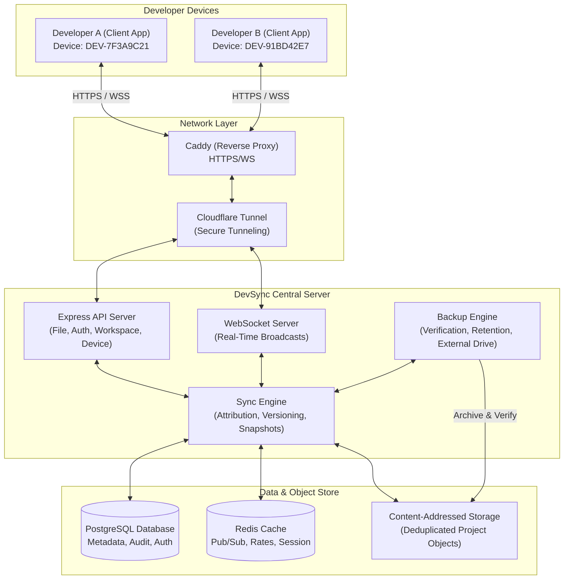
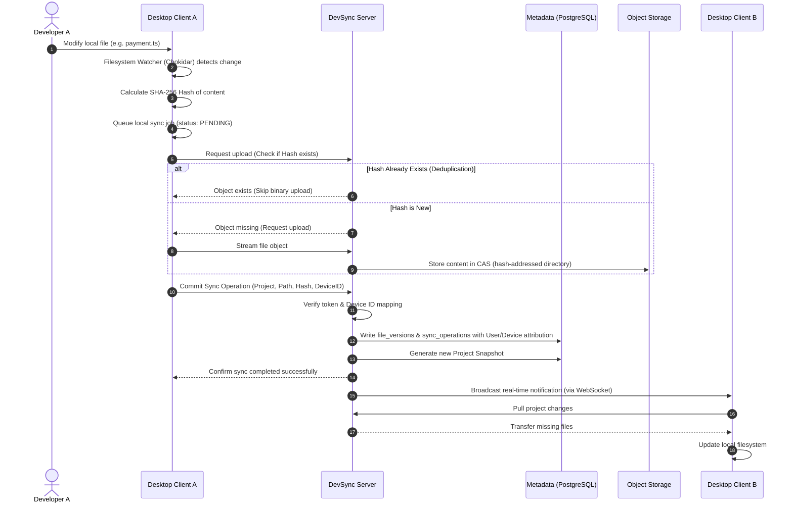
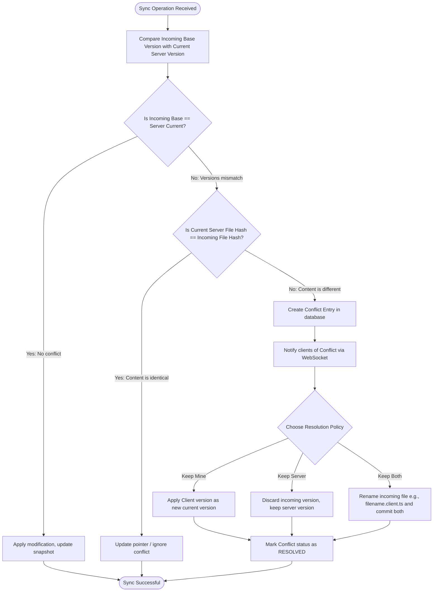
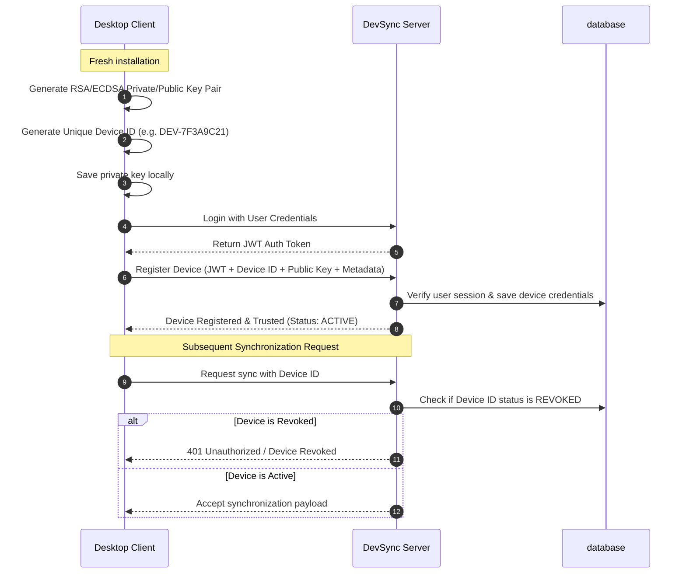

# DevSync — System Architecture & Flowcharts

This document details the system design, components, and core flow diagrams of the DevSync synchronization engine.

---

## 1. System Topology & Architecture

Below is the layout of the DevSync ecosystem, showing how the desktop clients interact with the central server and how the server manages local SQLite caches, remote storage, and configuration.

---

## 2. File Synchronization & Propagation Loop

This flowchart displays the path of a local file modification from the watcher to database attribution, storage deduplication, and immediate propagation to other registered clients.

---

## 3. Conflict Detection & Resolution Workflow

When two clients submit edits on the same file starting from the same base version, DevSync prevents overwrites through this verification and resolution workflow.

---

## 4. Device Identity & Handshake flow

This process secures the client connection and verifies cryptographic identities before any synchronization operation is permitted.

